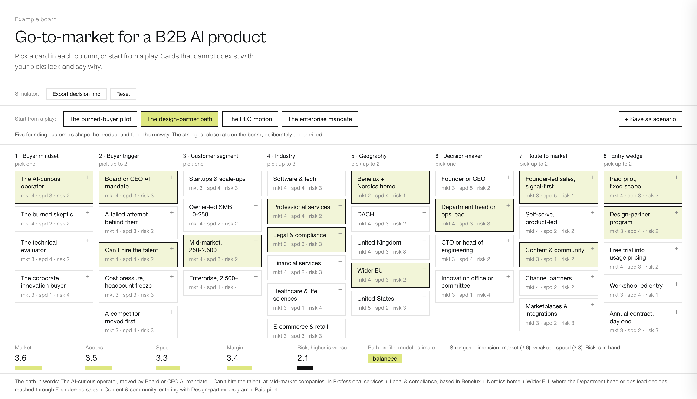

# Decision Board

Some decisions are not one choice. They are eight coupled choices that people argue about one at a time, in a different order each meeting, until the loudest version wins.

This skill turns that into a board. Each column is one variable of the decision, each card a value it can take. Combinations that cannot coexist in reality lock and say why. Every fact on a card carries a verbatim quote from its source. The scorecard shows what each path trades away and never collapses into a single number, because the single number hides the trade-off the decision turns on.

You hand it to an agent. It interviews you, researches the options, scores them with the judgment in the open, and gives you one HTML file you own.



*The worked example — a go-to-market decision. [Open the live version](https://keftek.com/lab/decision-simulator/).*

## Get it

Two files make a board: [`SKILL.md`](SKILL.md) is the method, [`assets/board.template.html`](assets/board.template.html) is the look. The skill fills the template; it never designs one.

**Attach it to a chat.** Download both files, attach them to a conversation with Claude (or any capable assistant), and say what you're deciding. Nothing to install. If you attach only `SKILL.md`, the agent fetches the template itself — it just needs to be online once.

**Install it.** Download the [latest release](../../releases/latest) zip and add it in your assistant's skill settings. It stays available in every conversation.

**Clone it.** For Claude Code:

```bash
git clone https://github.com/yuannc12/decision-board.git ~/.claude/skills/decision-board
```

## What you get

One HTML file. It opens from your filesystem — no server, no account, no build step, no network call. Share it, fork it, argue with it in a meeting. The research happens through whatever assistant you run; the finished board is yours and entirely local.

Every board comes out looking like the one above, because the agent never writes a line of CSS. The palette, type scale, card anatomy, drawer and scoreboard all live in the template, and the skill's last check is that the generated board's stylesheet is byte-identical to it. Your decision is yours; the design is not a thing each agent gets to reinvent.

## How it works

Three established methods, layered:

**General Morphological Analysis** (Zwicky, formalised by Ritchey) — decompose the decision into variables, enumerate the values each can take, study combinations instead of debating options one at a time.

**Cross-Consistency Assessment** — check option pairs for compatibility and lock the ones that cannot coexist, with the reason stated. Most bad strategies are not badly scored. They are internally contradictory, and this is what finds that.

**Multi-criteria scoring** — every card scored on a scorecard you define, each score with a stated reason you can grab and disagree with.

## What it refuses to do

**No invented financials.** No revenue projections, no close rates, no market-size math unless you supply your own numbers. A wrong number costs more credibility than a missing one.

**No unverified facts.** Every fact carries a verbatim quote that has to appear in the fetched source, matched as a fixed string. If it cannot be found, the fact is dropped and the drop is reported to you. Nothing gets softened into "studies show".

**No single score.** The dimensions stay separate. A weighted total would let a strong path hide a fatal weakness behind a good average.

**Facts and judgment never mix.** Verified facts sit in one layer with their sources; scores and estimates sit in another, labelled as the model's judgment. You can argue with the judgment. You should never have to doubt the facts.

## Credit

Boards generated by this skill keep one line in the footer:

> Built with Decision Board — keftek.com/lab/decision-simulator

Decision Board and its worked example: © 2026 [Keftek](https://keftek.com) — a strategy, design, and engineering studio for custom software, ML, and AI.

Have a decision shaped like this one? [Tell us what you're deciding](https://keftek.com/lab/decision-simulator/).
